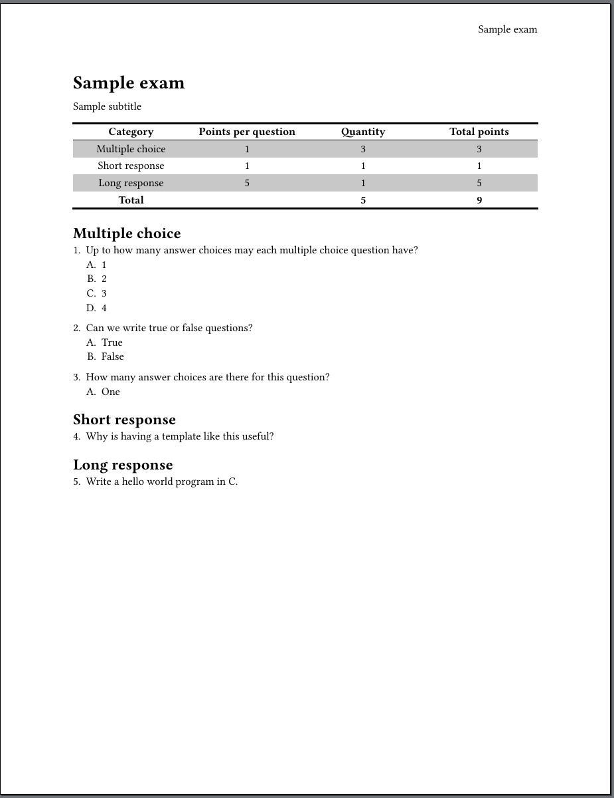
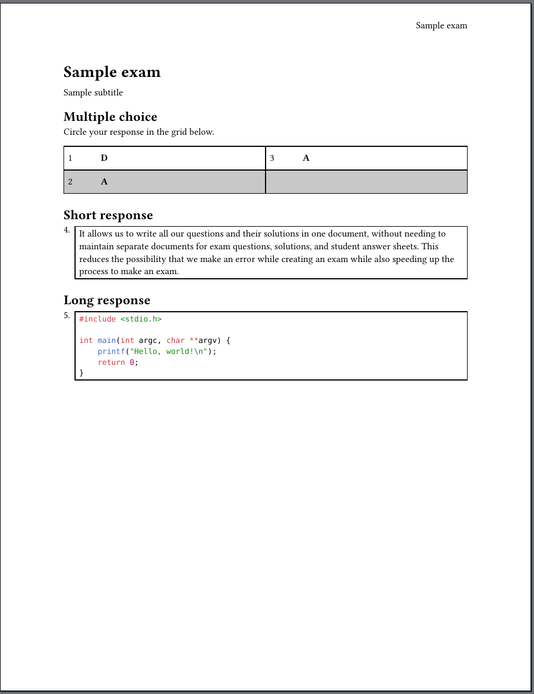
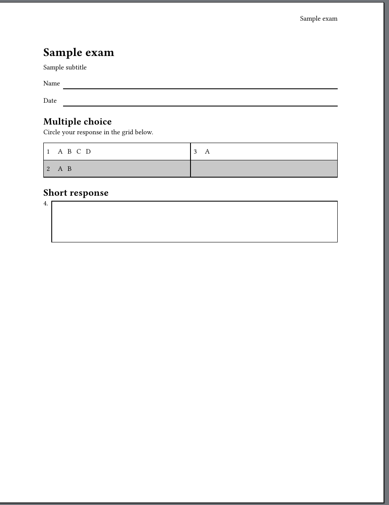
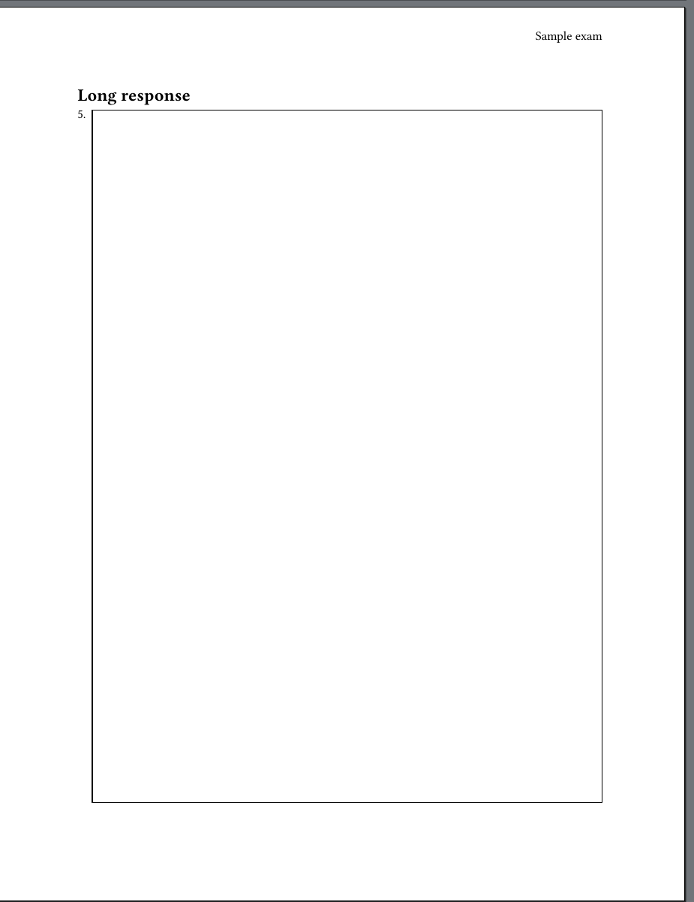

# Typst exam template

A single-file solution for maintaining exam questions, solutions, and student
answer sheets.

## Dependencies

- Make.

- [Typst 0.14.2](https://typst.app/open-source/#download)

## Quickstart

1. Clone this repo.

   ```bash
   git clone https://github.com/PappasBrent/exam-template my_exam
   ```

1. `cd` into the root of the cloned repo.

   ```bash
   cd my_exam
   ```

1. Run `make` to compile the sample exam's questions, solutions, and student
   answer sheets to PDF:

   ```bash
   make
   ```

   This will produce the following files:

   - `questions.pdf`: Exam questions.
   - `solutions.pdf`: Exam solutions.
   - `answer_sheet.pdf`: Student answer sheet.

1. Modify `questions.typ` for your exam, then recompile it with `make`.

## Exam question format

Exams consist of these parts:

    - A title.
    - An optional subtitle.
    - The number of rows in the answer matrix for multiple choice questions.
    - The number of columns in the answer matrix for multiple choice questions.
    - The number of points per multiple choice question.
    - The number of points per short response question.
    - The number of points per long response question.
    - A list of multiple choice questions.
    - A list of short response questions.
    - A list of long response questions.

The file `questions.typ` contains some starter code showing you how to specify
each of these components.

Multiple choice questions have the following form

```typst
(
    /* Specify body of the question in these brackets. Can use Typst
    formatting. */
    body: [ ]
    , a: [ ] // Answer choice A.
    , b: [ ] // Answer choice B; optional.
    , c: [ ] // Answer choice A; optional.
    , d: [ ] // Answer choice A; optional.

    /* Specify the letter of the solution here. This will only be printed in
    the solutions sheet. */
    , solution: "D"
)
```

Short and long response questions have the following form

```typst
(
    /* Specify body of the question in these brackets. Can use Typst
    formatting. */
    body: [ ]

    /* Specify the solution here. This will only be printed in the solutions
    sheet. */
    , solution: [ ]
)
```

## Screenshots of generated PDFs

Questions



Solutions



Answer sheet (2 pages)




